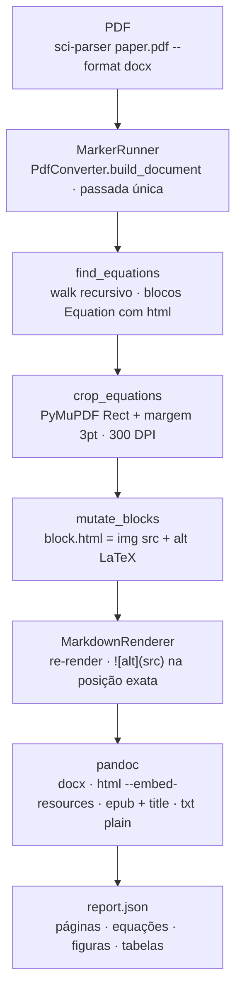

# sci-parser — PDFs científicos para markdown/docx/html/epub/txt (marker 2.0)

[](https://www.python.org/)
[](https://github.com/datalab-to/marker)
[](https://pymupdf.readthedocs.io/)
[](https://pandoc.org/)
[](https://pytest.org/)

## O que é

Um CLI que converte **PDFs científicos para markdown (padrão), docx, html,
epub ou txt** — com equações display preservadas como **imagens 300 DPI
(fidelidade pixel-perfect)** e figuras/tabelas extraídas nativamente pelo
[marker 2.0](https://github.com/datalab-to/marker) — sem cirurgia de regex
no markdown, sem conversão LaTeX não-confiável: PyMuPDF recorta a região
original do PDF e o alt text carrega o LaTeX best-effort do marker.

O truque central é mutar o bloco de equação **antes** do render — o
markdownify posiciona a ref na posição exata de leitura, sozinho:

```text
find_equations(document)        → EqSpec(page_id, bbox, alt, block)
crop_equations(pdf, eqs, dpi)   → eq_images/eq_p{page}_{n}.png via PyMuPDF
block.html = ''
MarkdownRenderer()(document)    → markdown com 
pandoc                          → docx | html | epub | txt
```

## Arquitetura

O ciclo do pipeline e o que ele faz com cada PDF:



## Números

| Item | Valor |
|------|-------|
| Fixture de regressão | `tests/data/attention.pdf` (15 páginas) |
| Equações | 5 display → 5 PNGs em `eq_images/` + 5 refs `` |
| Figuras | 5 (`_page_*.jpeg` do marker) |
| Tabelas | 4 reais (dedupe por `block.id` — Table aparece 2-3x na árvore) |
| Recorte | margem 3pt, 300 DPI (configurável via `--dpi`) |
| Modelos | ~2GB na primeira execução (cache em `~/.cache`) + `llama-server` |
| Docx final | 10 imagens embutidas (5 eqs + 5 figs em `word/media/`) |

## Uso

- **`sci-parser paper.pdf`** → `paper_parsed/` com markdown + assets
- **`sci-parser paper.pdf --format docx`** → também gera docx com tudo embutido
- **Formatos**: `md` (padrão), `docx`, `txt`, `html`, `epub`
- **Saída**: `<stem>.md` + `eq_images/` + `_page_*.jpeg` + `report.json`
- **Flags**: `-o/--output`, `--dpi 300`, `--title`, `--keep-latex-equations`, `--no-report`

```powershell
uv sync                                     # python 3.11 + marker-pdf + pymupdf
uv run sci-parser paper.pdf --format docx
uv run sci-parser paper.pdf --format html -o ./saida
uv run sci-parser paper.pdf --keep-latex-equations   # sem eq-images, LaTeX nativo
```

| Flag | Default | Descrição |
|------|---------|-----------|
| `--format` | `md` | Formato de saída |
| `-o/--output` | `<cwd>/<stem>_parsed` | Diretório de saída (erro se existir e não-vazio) |
| `--dpi` | `300` | Resolução dos recortes de equação |
| `--title` | metadata do PDF ou stem | Título (obrigatório internamente p/ epub) |
| `--keep-latex-equations` | off | Mantém o LaTeX nativo em vez de recortar imagens |
| `--no-report` | off | Não escrever `report.json` |

## Nota de comportamento

Math inline (subscritos na prosa) ainda sai degradado pelo OCR do marker —
`d_k` pode virar `dk`: só display equations viram imagem. Comportamento
esperado, não bug. Equações como imagem **não são pesquisáveis** — o alt text
carrega o LaTeX best-effort (LLMs multimodais leem a imagem; pipelines texto
puro leem o alt). `--format txt` renderiza equações como o alt text, senão
elas sumiriam do texto puro. O log "Force-killed llamacpp" do marker 2.0 é
normal (spawn/kill automático do `llama-server`).

## Desenvolvimento

### Rodar local

```powershell
brew install pandoc llama.cpp   # dependências externas (checadas no startup)
uv sync                          # python 3.11 + marker-pdf + pymupdf
uv run sci-parser tests/data/attention.pdf
```

### Verificação

```powershell
uv run pytest                                  # unit tests (rápido, sem modelos)
uv run pytest tests/test_integration.py        # integração (~30s, precisa dos modelos)
SCI_PARSER_SKIP_INTEGRATION=1 uv run pytest   # CI sem modelos
```

### Estrutura

```text
src/sci_parser/cli.py         # argparse, checks de ambiente, orquestração
src/sci_parser/pipeline.py    # build_document → crop → mutate → re-render → pandoc → report
src/sci_parser/runner.py      # MarkerRunner: create_model_dict + build_document (passada única)
src/sci_parser/equations.py   # find_equations + sanitize_alt + mutate_blocks para 
src/sci_parser/cropper.py     # PyMuPDF get_pixmap(clip=Rect, dpi) com margem 3pt
src/sci_parser/formats.py     # pandoc por formato + pré-processamento txt (img → alt)
tests/test_cli.py             # argparse, output dir não-vazio, checks sem pandoc
tests/test_equations.py       # walk recursivo com fakes duck-typed (sem modelos)
tests/test_cropper.py         # PDF sintético via pymupdf, assert de dimensões do PNG
tests/test_formats.py         # fixture md + imagem 1x1px nos 4 formatos
tests/test_integration.py     # attention.pdf: 5 eqs, 5 figs, 4 tabelas (gated por env)
tests/data/attention.pdf      # fixture de regressão
```

## Créditos

Layout, OCR, figuras e tabelas de
[marker 2.0](https://github.com/datalab-to/marker) (Datalab); recortes via
[PyMuPDF](https://pymupdf.readthedocs.io/); conversão final via
[pandoc](https://pandoc.org/). Decisão documentada em `PLAN.md` e `AGENTS.md`.
