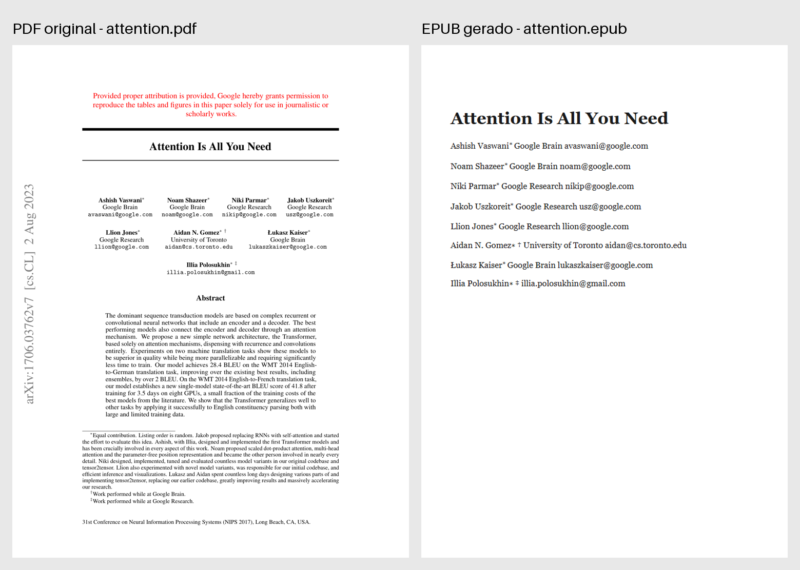

# sci-parser — PDFs científicos para markdown/docx/html/epub/txt (marker 2.0)

[](https://www.python.org/)
[](https://github.com/datalab-to/marker)
[](https://pymupdf.readthedocs.io/)
[](https://pandoc.org/)
[](https://pytest.org/)

> CLI que converte PDFs científicos para markdown, docx, html, epub ou txt —
> com equações display preservadas como imagens 300 DPI e figuras/tabelas
> extraídas nativamente pelo marker 2.0.

[Overview](#overview) • [Features](#features) • [Instalação](#instalação) •
[Uso](#uso) • [Desenvolvimento](#desenvolvimento) •
[Solução de problemas](#solução-de-problemas) • [Créditos](#créditos)



## Overview

O `sci-parser` executa **uma única passada de inferência** do
[marker 2.0](https://github.com/datalab-to/marker) (layout + OCR + equações +
tabelas) e converte o resultado para o formato desejado via
[pandoc](https://pandoc.org/). O diferencial está nas equações: em vez de
confiar na conversão LaTeX (que quebra pipe-tables e embaralha texto), o
pipeline recorta a região original do PDF em 300 DPI com PyMuPDF e carrega o
LaTeX best-effort do marker no alt text da imagem.

O truque central é mutar o bloco de equação **antes** do render — o
markdownify posiciona a referência na posição exata de leitura, sozinho:

```text
find_equations(document)        → EqSpec(page_id, bbox, alt, block)
crop_equations(pdf, eqs, dpi)   → eq_images/eq_p{page}_{n}.png via PyMuPDF
block.html = ''
MarkdownRenderer()(document)    → markdown com 
pandoc                          → docx | html | epub | txt
```

## Features

- **Equações como imagem pixel-perfect**: recortes 300 DPI da região original
  do PDF, com LaTeX best-effort no alt text (acessível e legível por LLMs
  multimodais).
- **5 formatos de saída**: `md` (padrão), `docx`, `html`, `epub` e `txt` —
  imagens embutidas nos formatos binários.
- **Figuras e tabelas nativas** do marker 2.0, sem pós-processamento frágil.
- **`report.json`** com contagens de validação (páginas, equações, figuras,
  tabelas) a cada execução.
- **Testes rápidos sem modelos**: unit tests usam fakes duck-typed; só a
  integração baixa os modelos.

## Instalação

Pré-requisitos:

- Python 3.11 e [uv](https://docs.astral.sh/uv/)
- `pandoc` e `llama-server` (o marker 2.0 exige o segundo para equações)

> [!IMPORTANT]
> O CLI valida as dependências externas no startup. Sem elas, falha com a
> instrução de instalação.

```powershell
brew install pandoc llama.cpp
uv sync
```

> [!NOTE]
> A primeira execução baixa os modelos do marker (~2GB, cache em `~/.cache`).

## Uso

```powershell
uv run sci-parser paper.pdf                  # → paper_parsed/ com markdown + assets
uv run sci-parser paper.pdf --format docx    # também gera docx com tudo embutido
uv run sci-parser paper.pdf --format html -o ./saida
uv run sci-parser paper.pdf --keep-latex-equations  # sem eq-images, LaTeX nativo
```

| Flag | Default | Descrição |
|------|---------|-----------|
| `--format` | `md` | Formato de saída (`md`, `docx`, `txt`, `html`, `epub`) |
| `-o/--output` | `<cwd>/<stem>_parsed` | Diretório de saída (erro se existir e não-vazio) |
| `--dpi` | `300` | Resolução dos recortes de equação |
| `--title` | metadata do PDF ou stem | Título (obrigatório internamente p/ epub) |
| `--keep-latex-equations` | off | Mantém o LaTeX nativo em vez de recortar imagens |
| `--no-report` | off | Não escrever `report.json` |

Cada execução gera:

```text
paper_parsed/
├── paper.md            # markdown final (refs de eq_images/ e figuras)
├── paper.docx          # (se --format docx) — imagens embutidas
├── eq_images/          # recortes de equação em 300 DPI
├── _page_*.jpeg        # figuras extraídas pelo marker
└── report.json         # contagens de validação
```

> [!TIP]
> Para texto puro pesquisável, `--format txt` substitui cada equação pelo
> LaTeX do alt text antes de chamar o pandoc — senão as equações sumiriam do
> `.txt`.

## Desenvolvimento

```powershell
uv run pytest                                  # unit tests (rápido, sem modelos)
uv run pytest tests/test_integration.py        # integração (~30s, precisa dos modelos)
SCI_PARSER_SKIP_INTEGRATION=1 uv run pytest   # CI sem modelos
```

Referência de regressão (`tests/data/attention.pdf`, 15 páginas): **5
equações, 5 figuras, 4 tabelas**. Se esses números mudarem, ou o marker mudou
de comportamento (está pinned em `marker-pdf==2.0.0`) ou o pipeline quebrou.
Tabelas são dedupadas por `block.id` — cada Table aparece 2-3x na árvore do
marker (child da página + dentro do TableGroup).

```text
src/sci_parser/cli.py         # argparse, checks de ambiente, orquestração
src/sci_parser/pipeline.py    # build_document → crop → mutate → re-render → pandoc → report
src/sci_parser/runner.py      # MarkerRunner: create_model_dict + build_document (passada única)
src/sci_parser/equations.py   # find_equations + sanitize_alt + mutate_blocks para 
src/sci_parser/cropper.py     # PyMuPDF get_pixmap(clip=Rect, dpi) com margem 3pt
src/sci_parser/formats.py     # pandoc por formato + pré-processamento txt (img → alt)
```

## Solução de problemas

- **"Force-killed llamacpp" no log**: normal — o marker 2.0 faz spawn/kill
  automático do `llama-server`.
- **Erro de diretório de saída existente e não-vazio**: use `-o` para escolher
  outro diretório.
- **`--format txt` sem equações**: verifique se usou `--keep-latex-equations`
  sem querer — o txt depende do alt text das eq-images.

## Limitações conhecidas

> [!NOTE]
> Math inline (subscritos na prosa) ainda sai degradado pelo OCR do marker —
> `d_k` pode virar `dk`. Só display equations viram imagem. Equações como
> imagem não são pesquisáveis; tabelas com math nas células podem sair
> quebradas. Comportamento esperado, não bug.

## Créditos

Layout, OCR, figuras e tabelas de
[marker 2.0](https://github.com/datalab-to/marker) (Datalab); recortes via
[PyMuPDF](https://pymupdf.readthedocs.io/); conversão final via
[pandoc](https://pandoc.org/).
